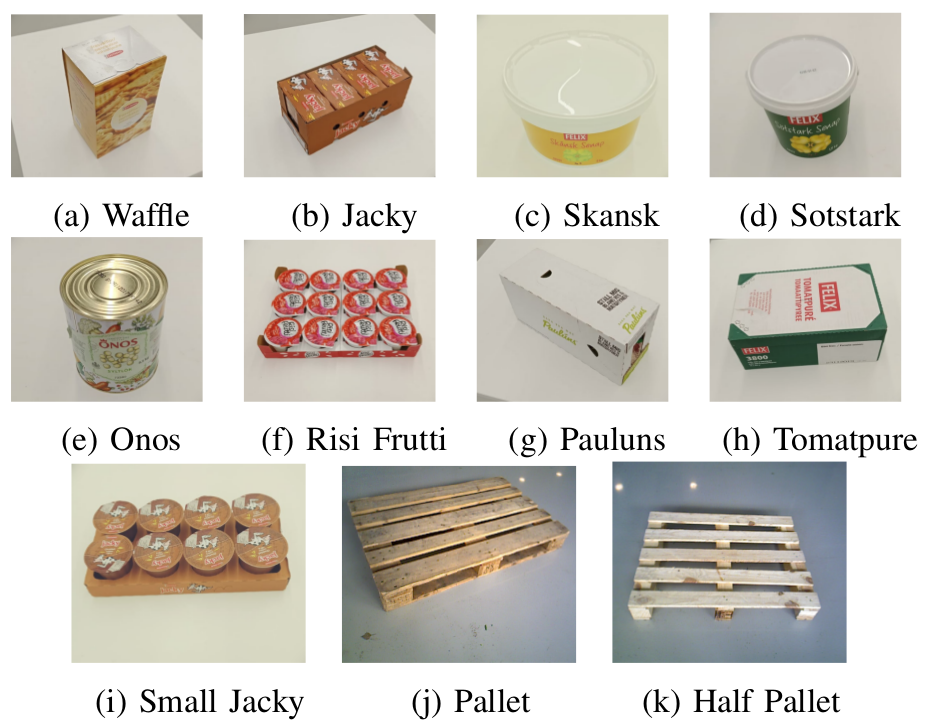
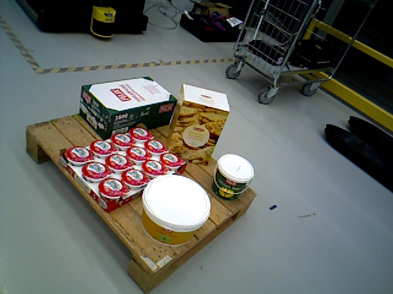
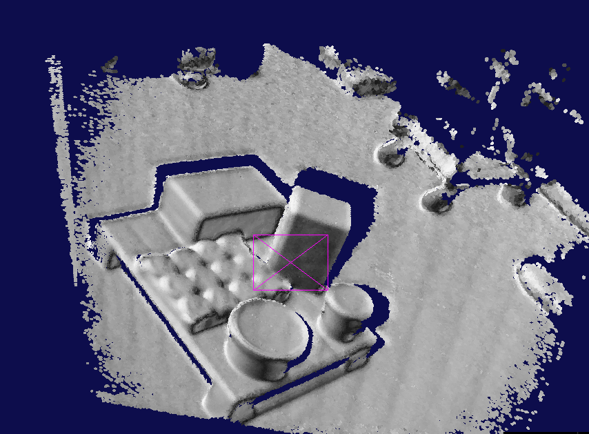
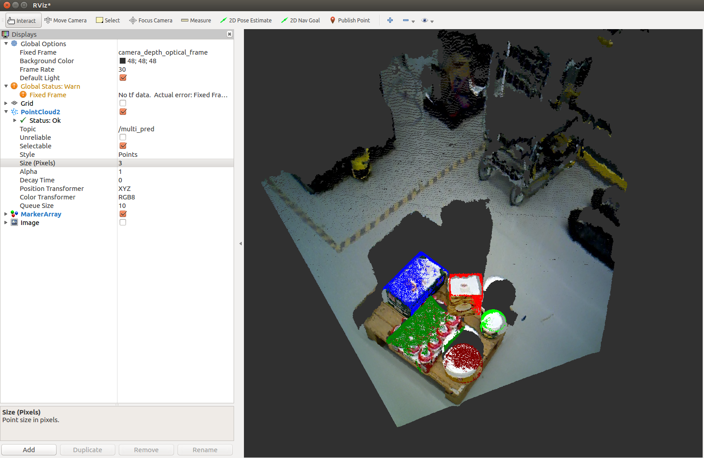

# 6D Object Pose Estimation (D6.4 [ILIAD](https://iliad-project.eu))
This contains a brief guide how to install / run the ROS-based simplified [Object-RPE](https://sites.google.com/view/object-rpe) developed at ORU in D6.4 [ILIAD](https://iliad-project.eu) project.

## The set of 11 objects in our warehouse dataset.


## Installation and compile the source
The tools require full ROS installation. The installation assumes you have Ubuntu 16.04 LTS [ROS Kinetic]
1. Clone the repository and switch to iliad branch
   ```bash
   $ https://github.com/hoangcuongbk80/Object-RPE.git
   $ git checkout iliad
   ```
2. ROS
   ```bash
   $ cd ~/catkin_ws
   $ catkin_make install
   ```
3. Segmentation [here](https://github.com/hoangcuongbk80/Object-RPE/tree/iliad/Mask_RCNN)
4. 3D mapping [here](https://github.com/hoangcuongbk80/Object-RPE/tree/iliad/obj_pose_est/mapping)
5. 6D object pose estimation [here](https://github.com/hoangcuongbk80/Object-RPE/tree/iliad/DenseFusion)

## Testing

1. Download data folder [here](https://drive.google.com/file/d/1dzwcLOiakkSLiUoJXkPD8-QkIBFTJMXQ/view?usp=sharing) and copy to ~/catkin_ws/src/Object-RPE

2. To test segmenation module:
   ```bash
   $ cd ~/catkin_ws/src/Object_RPE/Mask-RCNN/samples/warehouse
   $ python3 eval.py
   ```
   It will read rgb and ground-truth images from /rgb and gt/ folders in .../Object-RPE/data
   then save results (mask and accuracy.txt file) into .../Object-RPE/data/mask

   

3. To test 3D mapping module:
   ```bash
   $ cd ~/catkin_ws/src/Object-RPE/obj_pose_est/mapping/app
   $ ./obj_pose_est/mapping/app/build/mapping -l data/ 100
   ```
   

4. To test pose estimation module ([Video](https://www.youtube.com/watch?v=1CSoOjFgP-I)): 
   ```bash
   $ roscore
   ```
   In an other terminal:
   ```bash
   $ rosrun obj_pose_est ObjectRPE_srv.py
   ```
   In an other terminal:
   ```bash
   $ roslaunch obj_pose_est launch_object_rpe.launch
   ```
   

## How to operate the system?

   ```bash
   $ roscore
   $ rosrun obj_pose_est ObjectRPE_srv.py
   $ roslaunch obj_pose_est launch_rpe_cam.launch
   $ roslaunch openni2_launch openni2.launch
   ```
